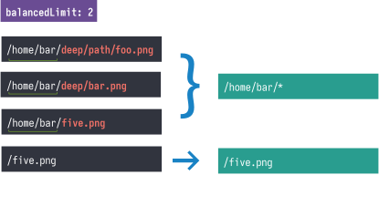

<h2 style="font-weight: normal" align="center">
   <br>
 S3/Cloudfront <b style="color: #A067FF">Smart</b> Invalidation
</h2>

**AWS Cloudfront invalidation requests cost 💰 once you're past the free limit (1000 / account). Issuing wildcard `/_` invalidations is
not an option because it causes total cache revalidation and negatively impacts performance.
This action provides a smart invalidation algorithm which just works. It issues as few invalidation requests as possible
whilst preserving user cache and preventing useless cache drops.**

<!-- toc -->

- [Usage](#usage)
- [Configuration](#configuration)
- [Invalidation strategies](#invalidation-strategies)
  - [Balanced](#balanced--recommended)
  - [Frugal](#frugal)
  - [Precise](#precise)
- [Motivation](#motivation)
- [Full example](#full-example)
- [License](#license)

<!-- tocstop -->

## Usage

```yaml
- name: Upload changes to S3 and issue Cloudfront invalidations
  uses: vladcosorg/action-s3-cloudfront-smart-deploy@v1
  with:
    source: local/path/to/dir
    target: s3://my-bucket-name/
    distribution: DOAJN11MNDAND
```

## Configuration

| Key                     | Description                                                                                      | Required | Default    | Value Type                          | Example                                                                  |
| ----------------------- | ------------------------------------------------------------------------------------------------ | -------- | ---------- | ----------------------------------- | ------------------------------------------------------------------------ |
| `source`                | Path to sync the files **from**                                                                  | Yes ❗   | N/A        | `path` or `S3 bucket URI`           | `relative/path/to/dir` <br> `/absolute/path` <br> `s3://my-bucket-name/` |
| `target`                | Target s3 bucket to sync **to**                                                                  | Yes ❗   | N/A        | `S3 bucket URI`                     | `s3://my-bucket-name/`                                                   |
| `s3args`                | [See here](https://docs.aws.amazon.com/cli/latest/reference/s3/sync.html)                        | No       | N/A        | `string`                            | `--exact-timestamps --delete`                                            |
| `distribution`          | Cloudfront distribution ID.                                                                      | No       | N/A        | `string`                            | `DOAJN11MNDAND`                                                          |
| `cfargs`                | [See here](https://docs.aws.amazon.com/cli/latest/reference/cloudfront/create-invalidation.html) | No       | N/A        | `string`                            | `--debug`                                                                |
| `invalidation-strategy` | Invalidation strategy [See description here](#invalidation-strategies)                           | No       | `BALANCED` | `BALANCED` or `PRECISE` or `FRUGAL` | `FRUGAL`                                                                 |
| `balanced-limit`        | Maximum amount of invalidation requests when using `BALANCED` strategy                           | No       | `5`        | `positive number` or `Ininity`      | 10                                                                       |

### Invalidation strategies

### `BALANCED` ✅ recommended

This strategy prioritizes issuing as many precise invalidations as possible (within set limits).
If this is not possible, it falls back to a hybrid mode which would issue a mix of targeted invalidations and wildcard invalidations.
And finally, if there are too many invalidations, it falls back to wildcard approach, **BUT** the wildcards are
as specific as possible, so that the consumers of the app would redownload as little as possible.

 For example if the value of `balanced-limit` is set to `5`, then it will issue up
to `5` invalidation requests. The action will never exceed this value.

If the `balanced-limit` value is too low to perform all necessary precise invalidations, then it will resort to the
wildcard approach, partially or completely.

The generated wildcards will try to minimize the number of invalidated files by narrowing its scope.

<div  align="center">



</div>

### `FRUGAL`

It's a shortcut to the `balanced-limit` set to `1`. It means that the action would always issues at most
1 invalidation request that is going to contain a scoped wildcard if you have more than 1 file that needs
to be invalidated.

🟠 **Attention**: This option, whilst very economical towards your AWS invalidation quota, would affect many
unrelated paths. Use with caution.

### `PRECISE`

It's a shortcut to the `balanced-limit` set to `Infinity`. It means that the action would always issue precise
invalidation requests, potentially

🧨 **Warning**: This option could potentially cost you a significant amount of money, because it will issue
1 invalidation request per 1 changed files. If you have lots of changed files that are frequently deployed to S3, think
again before using this option.

## Full example

```yaml
jobs:
  deploy:
    name: Upload to Amazon S3
    runs-on: ubuntu-latest
    # These permissions are needed to interact with GitHub's OIDC Token endpoint.
    permissions:
      id-token: write
      contents: read
    steps:
      - name: Checkout
        uses: actions/checkout@v3
      - name: Configure AWS credentials from Test account
        uses: aws-actions/configure-aws-credentials@v2
        with:
          role-to-assume: arn:aws:iam::111111111111:role/my-github-actions-role-test
          aws-region: us-east-1
      - name: Upload changes to S3 and issue Cloudfront invalidations
        uses: vladcosorg/action-s3-cloudfront-smart-deploy@v1
        with:
          source: local/path/to/dir
          target: s3://my-bucket-name/
          distribution: DOAJN11MNDAND
```

## Motivation

The available actions are using a simple yet inefficient approach that invalidates the changes using a precise
1 file -> 1 invalidation request approach, which potentially can result in a quite large monthly bill, provided that
your project is updated frequently and has a lot of files (exactly the case at my company).
Another approach is to issue general, root invalidations like `/*` which would cause the consumers of your app
to redownload the assets which did not actually change.

This action features a `BALANCED` approach which is as precise and as economical as you want it to be.

## License

This project is distributed under the [MIT license](LICENSE.md).
